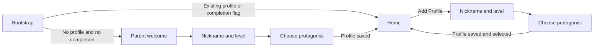

# Phase 3 Onboarding Flow Design

**Date:** 2026-08-21  
**Status:** Approved  
**Scope:** US-3.1 and US-3.2; US-3.3 excluded

## Context

Phase 3 introduces the first-time setup required before a parent creates stories. The existing app already has anonymous Supabase authentication, child-profile storage, a selected-profile context, a profile switcher, and the recurring story flow. The onboarding design must integrate with those foundations without implementing account registration, account claiming, or the paywall from US-3.3.

The original requirements contain several conflicts with the current product and design system:

- A simple math barrier does not reliably verify adulthood and adds friction to an app explicitly positioned as a parent utility outside the Kids Category.
- US-3.2 omits protagonist selection, while the PRD and current `ChildProfile` contract require it.
- US-3.2 specifies a developmental-level dropdown, while `DESIGN.md` requires visible selection rows for small single-choice lists.
- Software cannot reliably distinguish a nickname from a real name.
- US-3.2 describes local profile persistence, while the current story backend requires a Supabase `children.id` and the app already establishes an anonymous Supabase session.
- US-0.1 names Captain Whiskers, while the implemented catalog, TypeScript types, database constraint, and current data use Rex.

This specification resolves those conflicts explicitly.

## Goals

- Give a new parent a calm, low-friction first-run introduction.
- Collect the minimum profile data needed by story generation: bedtime nickname, developmental level, and protagonist.
- Create the profile under the current anonymous Supabase session.
- Reuse profile creation when an existing parent chooses Add Profile.
- Preserve the dark-only, low-stimulus design system.
- Keep all account creation, account upgrade, and paywall behavior out of this phase.

## Non-goals

- US-3.3 lazy auth, account claiming, or paywall behavior.
- Email, Apple, or other permanent account creation.
- Migration from an anonymous account to a permanent account.
- Profile editing or deletion.
- A local-first or dual local/cloud profile store.
- Child age, date of birth, or real-name collection.
- Automated real-name detection.
- Changes to story generation after onboarding.
- Replacing Rex with Captain Whiskers.

## Approved requirement changes

### US-3.1: First-Run Parent Welcome

US-3.1 is renamed from **Adult Gate** to **First-Run Parent Welcome**.

The app will not use a math challenge, birth-year field, or other claim of adult verification. Compliance is addressed through parent-directed positioning, data minimization, store classification, privacy disclosures, and later legal review—not an ineffective interaction barrier.

Acceptance criteria:

- A first-run parent welcome appears before the tab shell on a clean installation.
- The welcome uses the dark, low-stimulus design system.
- Copy includes: “Turn bedtime battles into life lessons.”
- The primary action is: “Create Tonight’s Story.”
- The welcome explicitly addresses a parent or guardian without requesting age data.
- Completion state is persisted and the welcome is not shown again after successful profile creation.
- Existing installations with at least one profile are treated as already onboarded.
- No tabs or Home content flash behind onboarding during bootstrap.

### US-3.2: Anonymous Profile Creation

Acceptance criteria:

- The parent enters a Bedtime Nickname.
- Placeholder copy is: “Sparky, Rocket, or Buddy.”
- Helper copy is: “Use a nickname, not a real name.”
- A text-only privacy notice says: “We never ask for real names or birthdates.”
- Developmental level is selected from three visible, single-choice rows:
  - Preschool
  - Early Primary
  - Older Kids
- A protagonist is explicitly selected from the five implemented characters:
  - Barnaby — Bear
  - Captain Nova — Star Pilot
  - Pip — Penguin
  - Luna — Owl
  - Rex — Dragon
- Profile details and protagonist selection use two focused screens.
- The profile is created in Supabase under the existing anonymous session.
- The created profile becomes the selected profile.
- Initial setup lands on Home after successful creation.
- The same two-screen flow supports Add Profile without showing the welcome.

## Navigation architecture

Use a dedicated root-level onboarding stack gated before the existing tab shell.

The bootstrap state has three observable values:

- `loading`: anonymous auth and onboarding/profile state are not yet resolved; render neither onboarding nor tabs.
- `onboardingRequired`: no completion flag and no existing profile; render the onboarding stack.
- `ready`: completion is known or an existing profile proves prior setup; render the existing app shell.

A root-gated stack is preferred over a modal or Home redirect because it prevents app-shell flashes, keeps tabs unavailable during first-time setup, and produces predictable history behavior.

## Existing-install compatibility

The current database trigger seeds five profiles for every new auth user. That behavior prevents a clean anonymous user from ever satisfying the “no profile” onboarding condition.

Phase 3 therefore requires a forward-only database migration that:

- Stops automatic child-profile seeding for future auth users.
- Does not delete or rewrite any existing child profiles.

Bootstrap migration behavior:

- Completion flag present: enter the app.
- Completion flag absent and one or more profiles exist: treat setup as complete and persist the completion state.
- Completion flag absent and no profiles exist: enter onboarding.

This preserves existing data and limits onboarding to genuinely unconfigured users.

## Screen design

### Parent welcome

Content:

- Deepest dark background.
- Tagline: “Turn bedtime battles into life lessons.”
- One short parent-directed supporting sentence.
- One full-width primary action: “Create Tonight’s Story.”

Motion:

- Use a single 150 ms ease-out opacity entrance.
- Render content statically when reduced motion is enabled.
- Do not use a logo reveal, spring/elastic motion, bright color field, spinner, or decorative animation.

The existing bright blue elastic splash overlay conflicts with the current design tokens and motion rules and is replaced as part of this flow.

### Profile details

Content:

- Title: “Who is tonight’s story for?”
- Label: “Bedtime nickname.”
- Placeholder: “Sparky, Rocket, or Buddy.”
- Helper: “Use a nickname, not a real name.”
- Text-only privacy notice: “We never ask for real names or birthdates.”
- Three inline developmental-level selection rows.
- One full-width primary action: “Continue.”

The Continue action remains disabled until the nickname and developmental level are valid.

The privacy notice deliberately omits the lock emoji from the original user story. `DESIGN.md` reserves emoji for post-story feedback and prohibits decorative emoji in UI chrome.

### Protagonist selection

Display five text-only selection rows using character name and species. Do not show emoji, decorative artwork, chevrons, or checkmarks. The selected row uses the existing neutral selected-surface treatment.

No protagonist is preselected. The parent makes an explicit choice.

Primary action labels:

- Initial setup: “Finish Setup.”
- Existing-user flow: “Add Profile.”

Back navigation returns to profile details without losing the current draft.

## Nickname contract

The app gives clear privacy guidance but does not claim to detect real names.

Before persistence:

- Trim leading and trailing whitespace.
- Collapse repeated internal spaces.
- Accept 1–24 visible characters after normalization.
- Allow Unicode letters and numbers, spaces, apostrophes, and hyphens.
- Reject line breaks, control characters, and unsupported punctuation.

Validation behavior:

- Do not validate on the first keystroke.
- Show a concise inline message after blur or attempted continuation.
- Do not use a name dictionary, classifier, model call, or network request.
- Never collect a date of birth, exact age, or separate real-name field.

## Component approach

Reuse the existing themed button and selection-row primitives. Use the existing design tokens exclusively.

A standard React Native text input is the preferred input for this phase. Introducing an `@expo/ui` `Host` and observable native state for a single field would create a second form convention without a material behavior benefit. If future screens establish a universal `@expo/ui` form convention, this decision can be revisited as a deliberate migration rather than a one-off mixture.

The Add Profile integration necessarily touches the current profile sheet. While doing so, the sheet should adopt the same text-only selection-row convention; its current emoji and checkmark presentation conflicts with `DESIGN.md`.

## Persistence and state transitions

Final profile submission follows this sequence:

1. Prevent duplicate submission and show a calm pending state.
2. Create the child row under the current anonymous Supabase user.
3. Add the returned profile to the selected-child state.
4. Select the returned profile.
5. Persist its ID as the selected profile.
6. For first-run setup, persist onboarding completion.
7. Replace onboarding navigation with Home.

The onboarding completion flag is written only after successful remote profile creation.

Recovery invariant:

- If remote creation succeeds but writing the local completion flag fails, the next bootstrap detects the existing profile and recovers to `ready` without creating a duplicate.

No full profile is duplicated into AsyncStorage in this phase. The anonymous Supabase profile is the sole profile source of truth; local storage contains only onboarding and selected-profile state.

## Failure handling

### Anonymous authentication failure

- Do not render a form that cannot submit.
- Show a calm, dedicated error state with Retry.
- Do not mark onboarding complete.

### Profile creation failure

- Retain nickname, developmental level, and protagonist.
- Re-enable submission.
- Show a concise inline error and Retry action.
- Do not create a fake local profile.
- Do not mark onboarding complete.

### Repeated submission

- Disable the final action while the request is pending.
- Treat a single successful response as the only state transition to completion.

## Add Profile flow

The existing profile sheet’s Add Profile row becomes active.

- It opens the same profile-details and protagonist-selection screens in add mode.
- The parent may cancel or navigate back to Home.
- The first-run parent welcome is never shown.
- Successful creation selects the new profile and returns Home.
- Failed creation retains the draft and remains retryable.
- No profile-count limit is introduced.

Profile editing and deletion remain outside this phase.

## Verification requirements

Behavioral coverage must establish:

- A clean anonymous user enters the welcome without flashing Home or tabs.
- An existing profile skips onboarding.
- Existing-install migration persists completion without deleting data.
- Welcome continues to profile details.
- Nickname normalization and the 1- and 24-character boundaries behave as specified.
- Invalid characters, line breaks, and control characters are rejected.
- Developmental level and protagonist are each single-choice.
- Continue and final submission enable only when their required fields are valid.
- Back navigation preserves the draft.
- Successful first-profile creation selects the returned profile, records completion, and lands on Home.
- Remote creation failure retains the draft and remains retryable.
- Relaunch after completion opens Home.
- Add Profile reuses the two-screen flow without the welcome.
- Successful Add Profile selects the new profile and returns Home.
- Reduced-motion mode removes the welcome entrance animation.

Runtime verification must exercise the actual iOS and Android surfaces and confirm:

- Keyboard avoidance and dismissal.
- Safe-area handling.
- Selection and press feedback.
- No tab shell during onboarding.
- Correct Home landing after completion.
- Correct back/cancel behavior in Add Profile mode.

Repository-wide `npm run lint` and `npm run typecheck` are required after implementation changes, in addition to focused behavioral verification.

## Resolved decisions

- Replace Adult Gate with parent welcome.
- Use guidance plus objective nickname format validation.
- Store profiles in anonymous Supabase for now.
- Use two focused profile screens.
- Use inline developmental-level selection rows.
- Keep Rex as the fifth protagonist.
- Land on Home after first-profile creation.
- Exclude US-3.3 entirely.

## Confidence

**High.** The design follows the current Expo Router shell, anonymous Supabase authentication, required `ChildProfile` fields, existing selection-row primitive, and the normative design system. Repository inspection identified one necessary backend cutover: automatic profile seeding must stop before clean users can enter onboarding.
